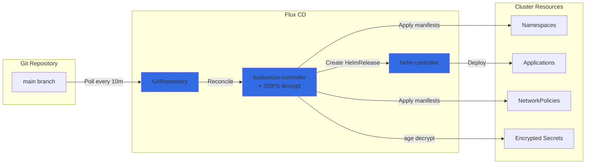
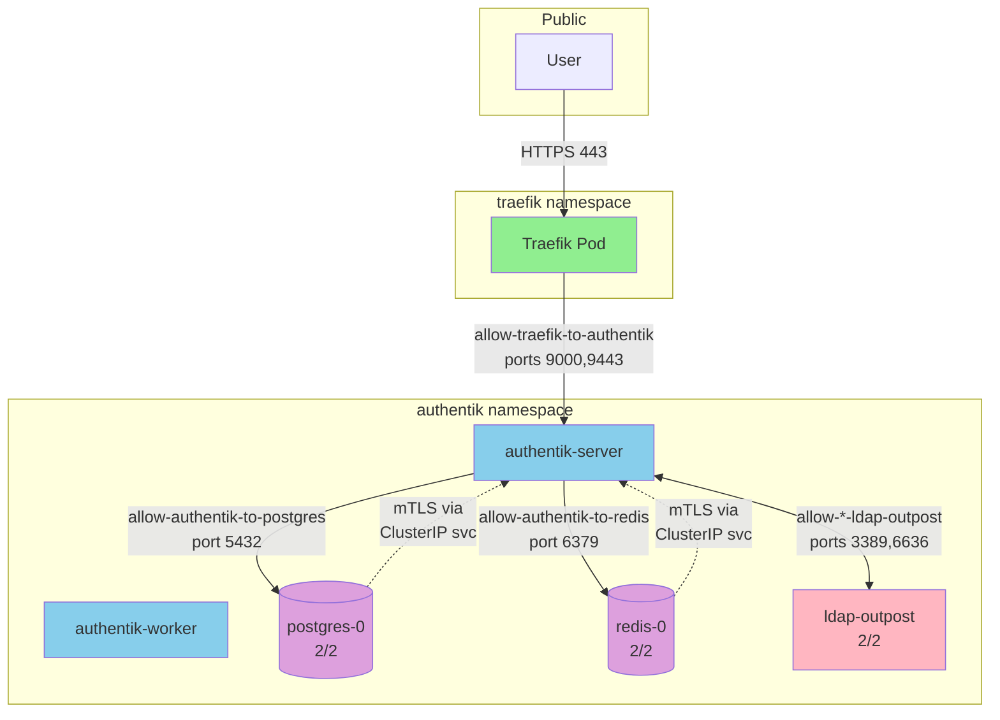

# k3s-gitops Architecture

Production-grade k3s Kubernetes cluster with GitOps automation, Zero Trust networking, and comprehensive security controls.

## Overview

**Platform**: k3s v1.33+ on Debian 12
**GitOps**: Flux CD v2
**Service Mesh**: Linkerd (mTLS)
**Policy Engine**: Kyverno
**Ingress**: Traefik v3
**Secrets**: SOPS with age encryption

## System Architecture

```mermaid
graph TB
    subgraph "External"
        Internet[Internet Traffic]
        LetsEncrypt[Let's Encrypt]
        Git[GitHub Repository]
    end

    subgraph "k3s Cluster"
        subgraph "Ingress Layer"
            Traefik[Traefik<br/>Load Balancer]
        end

        subgraph "Service Mesh"
            Linkerd[Linkerd Control Plane<br/>mTLS + Policy]
        end

        subgraph "Platform Services"
            CertManager[cert-manager<br/>TLS Automation]
            Kyverno[Kyverno<br/>Policy Enforcement]
            Flux[Flux<br/>GitOps]
        end

        subgraph "Application Layer"
            Authentik[Authentik<br/>SSO/Identity]
            AuthPG[(PostgreSQL)]
            AuthRedis[(Redis)]
            LDAP[LDAP Outpost]
            Linkwarden[Linkwarden<br/>Bookmarks]
            LinkPG[(PostgreSQL)]
        end

        subgraph "Network Layer"
            NetPol[NetworkPolicies<br/>Firewall Rules]
        end
    end

    Internet -->|HTTPS| Traefik
    Traefik -->|IngressRoute| Authentik
    Traefik -->|IngressRoute| Linkwarden
    LetsEncrypt -->|DNS-01| CertManager
    CertManager -->|Certificates| Traefik
    CertManager -->|Certificates| Authentik
    Git -->|Pull| Flux
    Flux -->|Reconcile| Traefik
    Flux -->|Reconcile| Authentik
    Flux -->|Reconcile| Linkwarden
    Flux -->|Reconcile| Kyverno
    Flux -->|Reconcile| NetPol

    Authentik -->|mTLS| AuthPG
    Authentik -->|mTLS| AuthRedis
    Authentik <-->|mTLS| LDAP
    Linkwarden -->|mTLS| LinkPG

    Linkerd -.->|Inject Proxy| Authentik
    Linkerd -.->|Inject Proxy| AuthPG
    Linkerd -.->|Inject Proxy| AuthRedis
    Linkerd -.->|Inject Proxy| LDAP
    Linkerd -.->|Inject Proxy| Linkwarden
    Linkerd -.->|Inject Proxy| LinkPG

    NetPol -.->|Enforce| Authentik
    NetPol -.->|Enforce| Linkwarden
    NetPol -.->|Enforce| Traefik
    Kyverno -.->|Validate| Authentik
    Kyverno -.->|Validate| Linkwarden

    style Linkerd fill:#2f4f4f
    style NetPol fill:#8b0000
    style Kyverno fill:#ffa500
```



## GitOps Flow



**Key Features**:
- **Declarative**: All cluster state in Git
- **Encrypted secrets**: SOPS with age keys
- **Dependency management**: Kustomizations wait for dependencies
- **Auto-healing**: Flux continuously reconciles cluster state

## Component Details

### Platform Services

| Component | Purpose | Version | Notes |
|-----------|---------|---------|-------|
| **Flux CD** | GitOps automation | v2 | Polls Git, applies manifests, manages Helm releases |
| **Linkerd** | Service mesh | v1.16+ | Automatic mTLS, identity-based policy, zero-config |
| **Traefik** | Ingress controller | v3 | HTTP→HTTPS redirect, IngressRoute CRDs |
| **cert-manager** | TLS automation | v1.x | Let's Encrypt DNS-01 via Cloudflare |
| **Kyverno** | Policy engine | v3.x | Admission control, resource validation, audit mode |

### Applications

| Application | Purpose | Databases | Storage |
|-------------|---------|-----------|---------|
| **Authentik** | SSO, OAuth2, LDAP | PostgreSQL 18 + Redis 8 | `local-path` PVCs (10Gi + 8Gi) |
| **LDAP Outpost** | LDAP server | - | Connects to Authentik API |
| **Linkwarden** | Bookmark manager | PostgreSQL 16 | `local-path` PVC (5Gi) |

### Network Architecture



**NetworkPolicy Strategy**:
- **Default Deny**: All namespaces start with no egress/ingress
- **Explicit Allow**: Each connection explicitly permitted
- **Service Mesh Compatible**: Allows DNS, Linkerd control plane, K8s API
- **Granular**: Per-pod label selectors, specific ports

## Zero Trust Design

### Layers of Security

1. **Network Segmentation** (NetworkPolicies)
   - Default deny all traffic
   - Explicit allowlist per service
   - Namespace isolation

2. **Identity & mTLS** (Linkerd)
   - Automatic mutual TLS between all pods
   - Certificate-based pod identity
   - Zero-trust service-to-service communication
   - No plaintext database credentials over network

3. **Policy Enforcement** (Kyverno)
   - Require resource limits (CPU/memory)
   - Disallow privileged containers
   - Enforce image registry restrictions
   - Require pod labels (audit mode)

4. **Secrets Management**
   - SOPS encryption with age keys
   - Secrets never committed in plaintext
   - Decrypted at deployment time only

5. **TLS Everywhere**
   - Let's Encrypt for external access
   - Linkerd mTLS for internal communication
   - LDAPS for directory access

### Security Boundaries

```mermaid
graph TB
    subgraph "Security Perimeter"
        subgraph "Internet"
            Client[Client Browser]
        end

        subgraph "Edge - Traefik Namespace"
            LB[Traefik<br/>NetworkPolicy: ingress only]
        end

        subgraph "App - Authentik Namespace"
            App[Authentik Server<br/>NetworkPolicy: DB + Redis only]
            DB[(Database<br/>NetworkPolicy: App only)]
        end

        subgraph "Service Mesh - Linkerd"
            Proxy1[Linkerd Proxy]
            Proxy2[Linkerd Proxy]
            Proxy3[Linkerd Proxy]
        end
    end

    Client -->|TLS 1.3| LB
    LB -->|mTLS| Proxy1
    Proxy1 --> App
    App -->|mTLS| Proxy2
    Proxy2 --> DB
    Proxy3 -.->|Policy Enforcement| App

    style LB fill:#90ee90
    style App fill:#87ceeb
    style DB fill:#dda0dd
    style Proxy1 fill:#2f4f4f
    style Proxy2 fill:#2f4f4f
    style Proxy3 fill:#2f4f4f
```



## Data Persistence

### Storage Strategy

- **StorageClass**: `local-path` (k3s built-in, hostPath-based)
- **Backup**: Not implemented (ephemeral dev cluster)
- **Production considerations**:
  - Migrate to `longhorn` or cloud storage (EBS, PD, Azure Disk)
  - Implement Velero for backup/restore
  - Use StatefulSet PVC templates for database HA

### Databases

| Database | Size | Usage | Retention |
|----------|------|-------|-----------|
| Authentik PostgreSQL | 10Gi | Users, sessions, flows | Persistent |
| Authentik Redis | 8Gi | Cache, sessions | Persistent (AOF enabled) |
| Linkwarden PostgreSQL | 5Gi | Bookmarks, tags | Persistent |

## Operational Patterns

### Deployment Flow

1. **Push to Git** → Trigger Flux reconciliation (10m poll or manual)
2. **Flux validates** → Kustomization dependencies enforced
3. **SOPS decrypt** → Secrets decrypted with age key
4. **Kyverno validates** → Policy checks (audit mode, doesn't block)
5. **Apply manifests** → kubectl apply via Flux
6. **Linkerd inject** → Sidecar proxy added to pods with annotation
7. **NetworkPolicy enforce** → Firewall rules applied

### Upgrading

**Applications**:
```bash
# Update HelmRelease version in Git
vim clusters/production/authentik/helmrelease.yaml
# Change spec.chart.spec.version

git commit -m "Update Authentik to vX.Y.Z"
git push

# Flux auto-applies (or manual)
flux reconcile kustomization authentik
```

**Platform Components**:
```bash
# Update Flux itself
flux install --export > clusters/production/flux-system/gotk-components.yaml

# Update Linkerd
linkerd upgrade > /tmp/linkerd-upgrade.yaml
# Review and apply
```

**Cluster Rebuild**:
- Terraform in separate `mailserver` repo
- Cloud-init installs k3s with `--disable traefik`
- Flux bootstrap from Git repository
- Auto-deploys entire stack from declarative config

### Monitoring & Observability

**Current**: Linkerd CLI for service mesh metrics
```bash
linkerd viz stat deploy -n authentik
linkerd viz tap deploy/authentik-server -n authentik
```

**Future** (Phase 7):
- Prometheus + Grafana
- Linkerd dashboards
- Kyverno policy reports
- cert-manager certificate expiry

### Troubleshooting

**Pod crashes**:
```bash
kubectl get pods -n authentik
kubectl logs -n authentik deployment/authentik-server --previous
kubectl describe pod -n authentik authentik-server-xxx
```

**NetworkPolicy issues**:
```bash
# Check policies
kubectl get netpol -n authentik
kubectl describe netpol -n authentik allow-authentik-to-postgres

# Test connectivity
kubectl run -it --rm debug --image=nicolaka/netshoot -n authentik -- bash
```

**mTLS issues**:
```bash
# Check Linkerd proxy status
linkerd check --proxy -n authentik

# Check identity
kubectl get pods -n authentik -o jsonpath='{.items[0].metadata.annotations.linkerd\.io/proxy-injector}'

# Check certificates
linkerd identity -n authentik
```

**Flux issues**:
```bash
flux get sources git
flux get kustomizations
flux logs --level=error
```

## Repository Structure

```
k3s-gitops/
├── clusters/production/          # Cluster-specific config
│   ├── flux-system/              # Flux CD controllers
│   │   ├── gotk-components.yaml  # Flux installation
│   │   ├── gotk-sync.yaml        # Git sync config
│   │   └── *-kustomization.yaml  # App deployment order
│   ├── authentik/                # Authentik SSO
│   ├── linkwarden/               # Bookmark manager
│   ├── traefik/                  # Ingress controller
│   ├── cert-manager/             # TLS automation
│   ├── linkerd/                  # Service mesh
│   ├── kyverno/                  # Policy engine
│   ├── kyverno-policies/         # Policy definitions
│   └── network-policies/         # Firewall rules
├── infrastructure/
│   ├── sources/                  # Helm repositories
│   └── cert-manager-config/      # ClusterIssuers
└── ARCHITECTURE.md               # This file
```

## Design Principles

1. **Declarative Configuration**: Everything in Git, zero manual kubectl
2. **Defense in Depth**: Multiple security layers (network, identity, policy, encryption)
3. **Least Privilege**: NetworkPolicies deny by default, explicit allows only
4. **Immutable Infrastructure**: Destroy and recreate from Git
5. **Audit Trail**: All changes via Git commits
6. **Fail Secure**: Kyverno in audit mode (doesn't block), NetworkPolicies enforcing
7. **Zero Configuration mTLS**: Linkerd auto-injects, no app changes

## Known Limitations

- **Single node**: No HA, node failure = downtime
- **Local storage**: No replication, data loss on node failure
- **No backups**: Implement Velero for production
- **Manual DNS**: Cloudflare records managed separately
- **Audit mode**: Kyverno policies log violations but don't enforce yet
- **Age key rotation**: Manual process, no automated key rotation

## Future Enhancements

- [ ] Velero backups to S3
- [ ] Prometheus + Grafana observability
- [ ] ArgoCD for advanced GitOps workflows
- [ ] External Secrets Operator for cloud secret stores
- [ ] Renovatebot for automated dependency updates
- [ ] Linkerd multi-cluster (if expanding beyond single node)
- [ ] OPA/Gatekeeper for advanced policy (if Kyverno insufficient)
